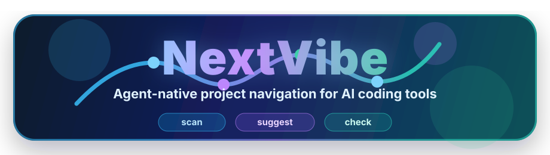

<p align="center">
  
</p>

<p align="center">
  <strong>Agent-native project navigation for AI-assisted development.</strong>
</p>

<p align="center">
  <a href="README.zh-CN.md">中文</a>
  ·
  <a href="docs/usage.md">Usage</a>
  ·
  <a href="docs/release.md">Release</a>
  ·
  <a href="docs/roadmap.md">Roadmap</a>
</p>

<p align="center">
  
  
  
  
</p>

NextVibe is a local CLI that tells coding agents what to build next. It scans a
project, detects visible development signals, suggests a bounded next task, and
checks whether the task has the expected artifacts.

It does not replace Codex, Claude Code, or Cursor. It gives them a reliable
local command they can call like `git`, `go test`, or `npm`.

## Why NextVibe

AI coding tools are good at scaffolding. Projects often slow down after the
first burst because the next step is unclear: API contract, backend boundary,
data model, tests, deployment, or agent instructions.

NextVibe answers one narrow question:

> What should the coding agent build next?

| Signal | What NextVibe does |
| --- | --- |
| 🧭 Project state | Scans files, folders, stacks, tests, and risks |
| 🎯 Next task | Suggests one bounded task with acceptance criteria |
| 🧱 Task boundary | Writes `.nextvibe/current-task.md` and task files |
| ✅ Verification | Checks required artifacts and changed paths |
| 🤖 Agent fit | Installs Codex, Claude Code, and Cursor instructions |

## Quick Start

Requires Go 1.22 or newer.

```bash
go build ./cmd/nextvibe
```

On Windows this creates `nextvibe.exe`. On macOS or Linux this creates
`./nextvibe`.

Run the core loop from a project root:

```bash
nextvibe init
nextvibe install all
nextvibe scan --json
nextvibe suggest --json
nextvibe task --json
nextvibe check --json
```

Human-readable output supports English and Chinese:

```bash
nextvibe scan --lang en
nextvibe scan --lang zh
nextvibe suggest --language zh
```

JSON output keeps stable field names and structure for agents and automation.

## Complete Local Flow

Use this flow to prove a fresh project is ready for agent-guided work:

```bash
nextvibe init
nextvibe install all
nextvibe scan --json
nextvibe suggest --json
nextvibe task --json
nextvibe check --json
```

Expected result:

- `.nextvibe/` exists and records project state
- `AGENTS.md`, `CLAUDE.md`, `.cursor/rules/nextvibe.mdc`, and Claude command files exist
- `scan --json` reports stacks, risks, signals, and likely test commands
- `suggest --json` returns one recommended task
- `task --json` creates or reads the active task
- `check --json` reports whether the task artifacts exist

## Core Commands

| Command | Purpose |
| --- | --- |
| `nextvibe init` | Create the `.nextvibe/` workspace |
| `nextvibe scan` | Inspect project signals and current stage |
| `nextvibe suggest` | Recommend the next bounded task |
| `nextvibe task` | Create or read the active task file |
| `nextvibe check` | Verify basic completion signals |
| `nextvibe install all` | Install Codex, Claude Code, and Cursor instructions |

Agent-facing commands support `--json`. Text commands support
`--lang en|zh` or `--language en|zh`.

## What Gets Created

```text
.nextvibe/
  project.md
  stage.md
  roadmap.md
  current-task.md
  decisions.md
  agent-context.md
  tasks/

AGENTS.md
CLAUDE.md
.cursor/rules/nextvibe.mdc
.claude/skills/nextvibe/SKILL.md
.claude/commands/nv-suggest.md
.claude/commands/nv-check.md
```

Existing files are preserved. NextVibe appends or updates managed sections
instead of replacing user-authored instructions.

## JSON Shape

`nextvibe scan --json` returns project state:

```json
{
  "projectName": "example-project",
  "detectedStacks": ["go", "react"],
  "keyFiles": ["README.md", "go.mod", "package.json"],
  "keyDirectories": ["components", "mock", "src"],
  "testCommands": ["go test ./...", "npm test"],
  "signals": {
    "hasFrontend": true,
    "hasBackend": true,
    "hasMockData": true,
    "hasApiContract": false,
    "hasDatabaseSchema": false,
    "hasTests": false,
    "hasDockerfile": false,
    "hasAgentInstructions": false
  },
  "stage": {
    "id": "frontend-prototype-backend-incomplete",
    "label": "Frontend prototype exists, backend contract missing"
  },
  "risks": ["Mock data detected", "No API contract found"]
}
```

`suggest`, `task`, and `check` also expose stable JSON for agents and scripts.

## Rule System

The first rules are local and deterministic. NextVibe reads repository signals
such as:

- `package.json`, `go.mod`, `pom.xml`, `build.gradle`
- `README.md`, `AGENTS.md`, `CLAUDE.md`
- `src/`, `app/`, `pages/`, `components/`
- `api/`, `server/`, `backend/`, `internal/`, `cmd/`
- `mock/`, `mocks/`
- `docs/api/`, `openapi.yaml`
- `migrations/`, `sql/`
- `test/`, `tests/`, `__tests__`, and common test filename suffixes
- `Dockerfile`, `docker-compose.yml`

It also detects simple local test commands:

- Go modules: `go test ./...`
- Node projects with a `test` script: `npm test`
- Maven projects: `mvn test`
- Gradle projects: `gradle test`

Priority rules start simple:

1. Missing project goal or implementation structure: write project goals first.
2. Frontend exists but API contract is missing: design the API contract.
3. API contract exists but data model is missing: design the data model.
4. Backend or business code exists but tests are missing: add focused tests.
5. Deployment config is missing: add a minimal deployment path.
6. Agent integration files are missing: run `nextvibe install all`.

## Platform Support

NextVibe targets Windows, macOS, and Linux.

CI runs tests on all three operating systems and cross-compiles release binaries
for:

- `linux/amd64`
- `linux/arm64`
- `darwin/amd64`
- `darwin/arm64`
- `windows/amd64`
- `windows/arm64`

Tagged GitHub releases publish `.tar.gz` archives for macOS and Linux and `.zip`
archives for Windows. See [docs/release.md](docs/release.md).

## Product Boundaries

In scope now:

- Cross-platform Go CLI
- `.nextvibe/` project state
- Project scanning and stage detection
- Next-task recommendation
- Current task generation
- Basic task checking
- Codex, Claude Code, and Cursor integration files
- Stable JSON output for agents
- English and Chinese text output

Out of scope for now:

- Web UI
- Cloud service
- Account system
- Model API integration
- MCP server
- Prompt marketplace
- Package-manager distribution

MCP can be added later as another way to expose the same local protocol. It
should not change the core principle: NextVibe helps agents navigate local
project state; it does not become the model.

## Project Map

| Path | Purpose |
| --- | --- |
| `cmd/nextvibe` | CLI entrypoint |
| `internal/scanner` | File and directory inventory |
| `internal/detector` | Stack, signal, stage, and test-command detection |
| `internal/planner` | Next-task recommendation rules |
| `internal/taskgen` | Current task and task file generation |
| `internal/checker` | Basic task completion checks |
| `internal/installer` | Agent integration file generation |
| `docs/` | Usage, release, roadmap, deployment, and product notes |

## More Docs

- [Usage](docs/usage.md)
- [Release](docs/release.md)
- [Deployment](docs/deployment.md)
- [Roadmap](docs/roadmap.md)
- [Vision](docs/vision.md)
- [Agent-native Design](docs/agent-native-design.md)
